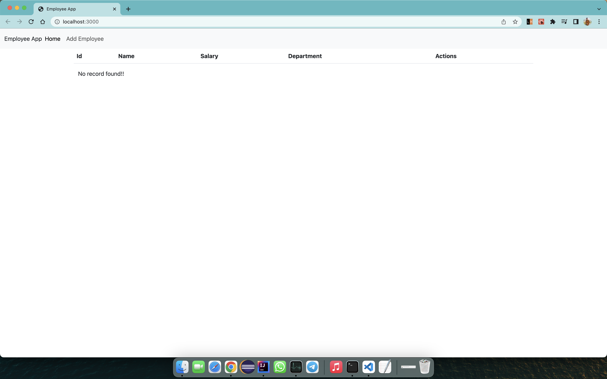
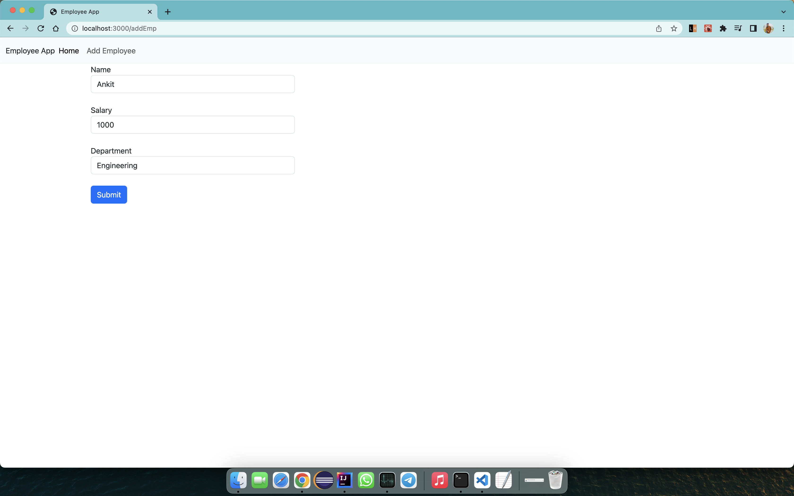
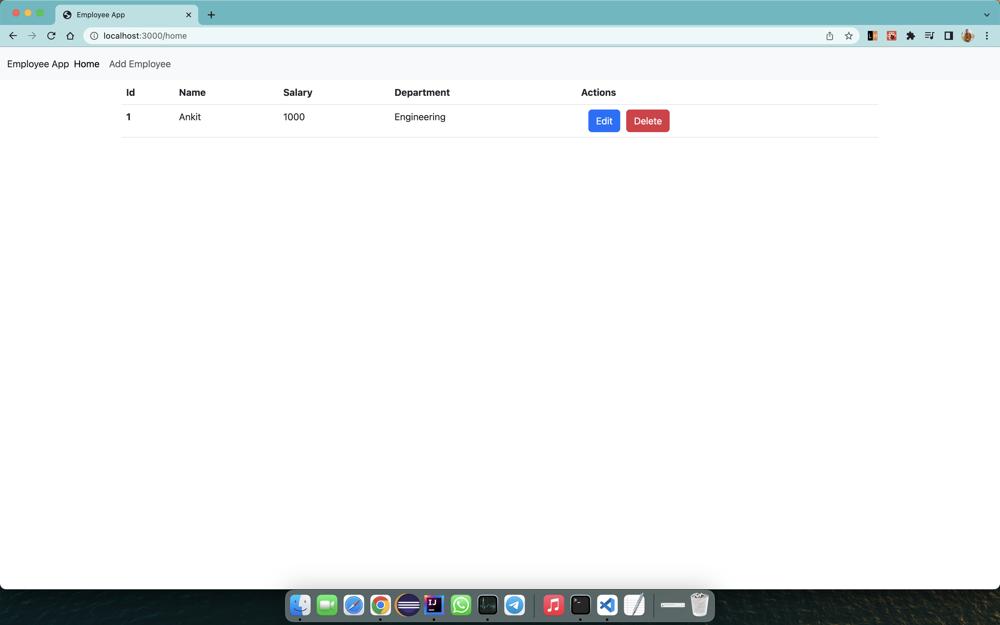
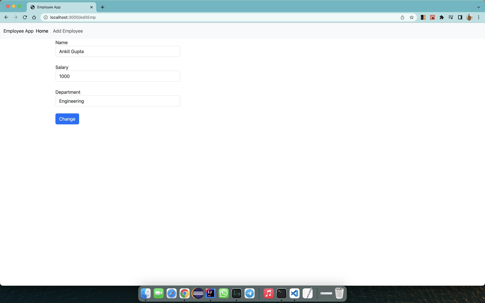

<h1 align="center">Employee App</h1>
<p align="center">Screenshot's of the App</p>

Home Page 
Add Employee Page
Edit & Delete Page
Edit Employee Page

## Features

- **Four sections** - Namely Home, Add Employee, Edit Employee and Delete Employee
- **Technologies Used**
  - **FrontEnd Languages**
    - ReactJs, React Hooks, SCSS and SASS
  - **BackEnd Languages**
    - Java, SpringBoot, Hibernate, H2 Database

## About

This is an CRUD Application that I have made to integrate frontend and backend of two different techstacks, just to increase my understanding.

## Demo Development

Clone and install.

```bash
git https://github.com/ankit-95/EmployeeApp.git
cd EmployeeApp
```

Run application.

For Backend Web-Service

```bash
mvn spring-boot:run
```

For FrondEnd Web-Service

```bash
cd employee-frontend
npm start
```

## Author

- [Ankit Gupta](https://ankit-95.github.io)
